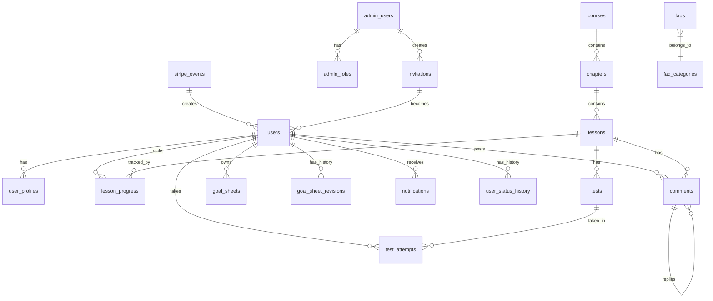

# Supabase テーブル設計 叩き台

**作成日**: 2026-05-19
**作成者**: Claude（フェーズ0 完了後の単独作業）
**目的**: フェーズ1（骨組み設計）の冒頭で確定するための叩き台
**位置づけ**: 提案レベル。きよむさんレビュー → フェーズ1 で正式版 → マイグレーション SQL に変換

---

## 🎯 一言まとめ

> **MVP 12機能** を支える **16テーブル**（=13コア + 3補助）の Supabase スキーマ設計。
>
> **新サイトと trainercloud は完全に別アプリ・別管理**（連携機能なし確認済み、2026-05-19）。
>
> 食事添削も体重ログも trainercloud で完結するため、新サイト側には身体情報なし。
>
> RLS（Row Level Security）で受講生は自分のデータのみ、管理者は全データへアクセス可能。
>
> 既存資産（01_tokuten/voices-data.json）のスキーマを踏襲し、将来統合できる設計。

## 🔄 2026-05-19 簡素化（食事関連削除 + 連携削除）

### 食事関連削除
- ❌ 削除: `food_review_requests` テーブル
- ❌ 削除: `food-review-images` バケット
- ❌ 削除: 食事スタッフ専用ロール（`role = 'food_staff'`）
- → 食事添削は trainercloud 内で完結（食事ログ + メッセージ機能）
- → 食事スタッフ（ゆうきくん）は trainercloud のみ使用、新サイトにはログイン不要

### trainercloud 連携削除（連携機能なし確認、2026-05-19）
- ❌ 削除: 「将来 SSO 連携」想定
- ❌ 削除: 「将来 完全統合」想定
- ✅ 確定: **新サイトと trainercloud は永久に別アプリ・別管理**
- ✅ 受講生は両方のアカウント別途持つ（メアドは共通可）

### user_profiles から身体情報削除
- ❌ 削除: `height_cm`（身長）
- ❌ 削除: `gender`（性別）
- ✅ 残す: `birthday`（生年月日）
- → 新サイトで必要なのはコメント表示・賞状発送用の最小限のみ

---

## 📊 全体像（ER 図）



---

## 🗂 テーブル定義（13 + 5 = 18 テーブル）

### 🔴 コア (8テーブル)

#### 1. `users` - 受講生マスタ
| カラム | 型 | 制約 | 説明 |
|---|---|---|---|
| id | uuid | PK | Supabase Auth と紐付け |
| email | text | UNIQUE NOT NULL | メアド |
| name | text | NOT NULL | 氏名 |
| nickname | text | | 表示名 |
| line_user_id | text | | LINE 連携用 |
| stripe_customer_id | text | | Stripe 顧客ID |
| status | text | NOT NULL DEFAULT 'active' | active / lifetime / withdrawn / refunding |
| joined_at | timestamptz | NOT NULL | 入会日 |
| support_until | timestamptz | | サポート期間終了日（180日後）|
| graduated_at | timestamptz | | 卒業日 |
| created_at | timestamptz | NOT NULL DEFAULT now() | |
| updated_at | timestamptz | NOT NULL DEFAULT now() | |

**RLS**: 受講生は自分の行のみ閲覧・編集可。管理者は全閲覧可。

---

#### 2. `user_profiles` - 受講生プロフィール
| カラム | 型 | 制約 | 説明 |
|---|---|---|---|
| user_id | uuid | PK / FK→users | |
| avatar_url | text | | |
| family_name | text | | 姓 |
| given_name | text | | 名 |
| birthday | date | | 生年月日 |
| phone | text | | |
| address | text | | 住所（紙の認定証発送用）|
| twitter | text | | |
| facebook | text | | |
| instagram | text | | |
| line_account | text | | 表示用 LINE ID |
| bio | text | | 自己紹介 |
| updated_at | timestamptz | NOT NULL DEFAULT now() | |

> **削除**: `height_cm`（身長）/ `gender`（性別）→ 新サイトでは不要
> （trainercloud との連携なしのため、必要な情報のみ最小限保持）

---

#### 3. `courses` - コース（5大カテゴリ）
| カラム | 型 | 制約 | 説明 |
|---|---|---|---|
| id | uuid | PK | |
| title | text | NOT NULL | 例: 限定ボディメイク完全ロードマップ動画 |
| description | text | | |
| sort_order | integer | NOT NULL | 表示順 |
| is_published | boolean | DEFAULT true | 公開フラグ |
| created_at | timestamptz | NOT NULL DEFAULT now() | |
| updated_at | timestamptz | NOT NULL DEFAULT now() | |

---

#### 4. `chapters` - 章
| カラム | 型 | 制約 | 説明 |
|---|---|---|---|
| id | uuid | PK | |
| course_id | uuid | FK→courses NOT NULL | |
| title | text | NOT NULL | 例: 0. はじめに必ず視聴して下さい |
| description | text | | |
| sort_order | integer | NOT NULL | |
| released_at | timestamptz | | 段階公開: 指定日時以降公開 |
| created_at | timestamptz | NOT NULL DEFAULT now() | |
| updated_at | timestamptz | NOT NULL DEFAULT now() | |

---

#### 5. `lessons` - レッスン
| カラム | 型 | 制約 | 説明 |
|---|---|---|---|
| id | uuid | PK | |
| chapter_id | uuid | FK→chapters NOT NULL | |
| title | text | NOT NULL | 例: ベンチプレス |
| description | text | | |
| vimeo_url | text | | Vimeo 埋め込み URL |
| summary_video_url | text | | 「全まとめ視聴用」動画 URL |
| sub_image_url | text | | 補助画像（解剖図など）|
| meta_tags | jsonb | | 部位タグ等（例: ["胸", "自重"]）|
| sort_order | integer | NOT NULL | |
| released_at | timestamptz | | 段階公開: 指定日時以降公開 |
| created_at | timestamptz | NOT NULL DEFAULT now() | |
| updated_at | timestamptz | NOT NULL DEFAULT now() | |

---

#### 6. `lesson_progress` - 学習進捗
| カラム | 型 | 制約 | 説明 |
|---|---|---|---|
| user_id | uuid | PK1 / FK→users | |
| lesson_id | uuid | PK2 / FK→lessons | |
| is_completed | boolean | DEFAULT false | できた！ボタン押下 |
| completed_at | timestamptz | | |
| watched_seconds | integer | | 視聴秒数（Vimeo Player API から）|
| last_watched_at | timestamptz | | |
| created_at | timestamptz | NOT NULL DEFAULT now() | |

**インデックス**: `(user_id, is_completed)`, `(user_id, last_watched_at)`

---

#### 7. `comments` - コメント（公開・スレッド型）
| カラム | 型 | 制約 | 説明 |
|---|---|---|---|
| id | uuid | PK | |
| lesson_id | uuid | FK→lessons NOT NULL | |
| user_id | uuid | FK→users NOT NULL | |
| parent_comment_id | uuid | FK→comments | スレッド返信用 |
| body | text | NOT NULL | |
| image_url | text | | 画像添付 |
| is_deleted | boolean | DEFAULT false | 論理削除 |
| created_at | timestamptz | NOT NULL DEFAULT now() | |
| updated_at | timestamptz | NOT NULL DEFAULT now() | |

**インデックス**: `(lesson_id, created_at)`, `(user_id)`

---

#### 8. `goal_sheets` - 目標管理シート（★主軸）
| カラム | 型 | 制約 | 説明 |
|---|---|---|---|
| user_id | uuid | PK / FK→users | 1人1シート |
| content | jsonb | NOT NULL | 目標項目（柔軟に拡張可）|
| admin_notes | text | | 管理者コメント |
| reviewed_by | uuid | FK→admin_users | レビュー担当 |
| reviewed_at | timestamptz | | |
| created_at | timestamptz | NOT NULL DEFAULT now() | |
| updated_at | timestamptz | NOT NULL DEFAULT now() | |

#### 8b. `goal_sheet_revisions` - 目標シート編集履歴
| カラム | 型 | 制約 | 説明 |
|---|---|---|---|
| id | uuid | PK | |
| user_id | uuid | FK→users NOT NULL | |
| snapshot | jsonb | NOT NULL | 編集時点のスナップショット |
| edited_by | uuid | FK→users or admin_users | 編集者 |
| reason | text | | 編集理由（任意）|
| created_at | timestamptz | NOT NULL DEFAULT now() | |

> きよむさん仕様「**最初に設定 → いつでも見れる → 状況に応じて編集**」を実現するため、最新版を `goal_sheets` に、過去履歴を `goal_sheet_revisions` に保存。

---

### 🟡 試験 (2テーブル)

#### 9. `tests` - 試験
| カラム | 型 | 制約 | 説明 |
|---|---|---|---|
| id | uuid | PK | |
| lesson_id | uuid | FK→lessons | （テストレッスン）|
| title | text | NOT NULL | |
| passing_score | integer | DEFAULT 80 | 合格点（%）|
| questions | jsonb | NOT NULL | 問題リスト（多肢選択）|
| created_at | timestamptz | NOT NULL DEFAULT now() | |
| updated_at | timestamptz | NOT NULL DEFAULT now() | |

#### 10. `test_attempts` - 受験履歴
| カラム | 型 | 制約 | 説明 |
|---|---|---|---|
| id | uuid | PK | |
| user_id | uuid | FK→users NOT NULL | |
| test_id | uuid | FK→tests NOT NULL | |
| score | integer | NOT NULL | 正答率（%）|
| passed | boolean | NOT NULL | |
| answers | jsonb | | 解答内容（任意）|
| taken_at | timestamptz | NOT NULL DEFAULT now() | |

**ユニーク**: なし（**何度でも受験可**）

---

### 🟢 管理・運用 (4テーブル)

#### 11. `admin_users` - 管理者
| カラム | 型 | 制約 | 説明 |
|---|---|---|---|
| id | uuid | PK | Supabase Auth と紐付け |
| email | text | UNIQUE NOT NULL | |
| name | text | NOT NULL | 例: 阿部紀洋（社長）, きよむ |
| role | text | NOT NULL | superadmin / admin |
| is_active | boolean | DEFAULT true | |
| created_at | timestamptz | NOT NULL DEFAULT now() | |

> ロールは **superadmin（社長）** と **admin（きよむさん他）** のみ。
> 食事スタッフは trainercloud だけ使うので新サイトにロールなし。

#### 12. `invitations` - 招待リンク
| カラム | 型 | 制約 | 説明 |
|---|---|---|---|
| id | uuid | PK | |
| email | text | NOT NULL | 招待先メアド |
| name | text | | 招待先氏名 |
| token | text | UNIQUE NOT NULL | 一意トークン |
| expires_at | timestamptz | NOT NULL | 有効期限（48時間）|
| created_by | uuid | FK→admin_users | 招待した管理者 |
| accepted_at | timestamptz | | 承認日時 |
| user_id | uuid | FK→users | 承認後の受講生ID |
| stripe_event_id | uuid | FK→stripe_events | 紐づく Stripe イベント |
| created_at | timestamptz | NOT NULL DEFAULT now() | |

#### 13. `stripe_events` - Stripe Webhook イベント記録
| カラム | 型 | 制約 | 説明 |
|---|---|---|---|
| id | uuid | PK | |
| stripe_event_id | text | UNIQUE NOT NULL | Stripe 側の ID |
| event_type | text | NOT NULL | checkout.session.completed 等 |
| payload | jsonb | NOT NULL | Webhook ペイロード |
| customer_email | text | | |
| amount | integer | | 決済額 |
| processed_at | timestamptz | | 招待発行済みフラグ |
| created_at | timestamptz | NOT NULL DEFAULT now() | |

---

### 🔵 補助 (5テーブル)

#### 14. `broadcast_notifications` - 管理者によるお知らせ配信
| カラム | 型 | 制約 | 説明 |
|---|---|---|---|
| id | uuid | PK | |
| title | text | NOT NULL | |
| body | text | NOT NULL | リッチテキスト |
| target_segment | text | NOT NULL | all / active / lifetime / by_chapter |
| target_chapter_id | uuid | FK→chapters | by_chapter の場合 |
| send_email | boolean | DEFAULT false | メール送信フラグ |
| scheduled_at | timestamptz | | 予約配信時刻 |
| sent_at | timestamptz | | 実際の配信時刻 |
| created_by | uuid | FK→admin_users NOT NULL | |
| created_at | timestamptz | NOT NULL DEFAULT now() | |

> お知らせ配信機能（M-12 内のサブ機能）の本体。各受講生への配信レコードは `notifications` テーブルに INSERT される（`broadcast_notification_id` カラム経由で参照）。

#### 15. `notifications` - 通知
| カラム | 型 | 制約 | 説明 |
|---|---|---|---|
| id | uuid | PK | |
| user_id | uuid | FK→users NOT NULL | |
| type | text | NOT NULL | system / lesson / comment / broadcast |
| title | text | NOT NULL | |
| body | text | | |
| link_url | text | | クリック時の遷移先 |
| broadcast_notification_id | uuid | FK→broadcast_notifications | お知らせ配信の場合 |
| is_read | boolean | DEFAULT false | |
| created_at | timestamptz | NOT NULL DEFAULT now() | |

#### 16. `user_status_history` - ステータス変更履歴
| カラム | 型 | 制約 | 説明 |
|---|---|---|---|
| id | uuid | PK | |
| user_id | uuid | FK→users NOT NULL | |
| from_status | text | | |
| to_status | text | NOT NULL | |
| changed_by | uuid | FK→admin_users | |
| reason | text | | |
| changed_at | timestamptz | NOT NULL DEFAULT now() | |

#### 17. `faqs` - FAQ
| カラム | 型 | 制約 | 説明 |
|---|---|---|---|
| id | uuid | PK | |
| category_id | uuid | FK→faq_categories NOT NULL | |
| question | text | NOT NULL | |
| answer | text | NOT NULL | |
| sort_order | integer | NOT NULL | |
| is_published | boolean | DEFAULT true | |
| created_at | timestamptz | NOT NULL DEFAULT now() | |
| updated_at | timestamptz | NOT NULL DEFAULT now() | |

#### 17b. `faq_categories` - FAQ カテゴリ
| カラム | 型 | 制約 | 説明 |
|---|---|---|---|
| id | uuid | PK | |
| name | text | NOT NULL | 例: はじめに、学習・コンテンツ |
| sort_order | integer | NOT NULL | |

#### 18. `graduate_voices`（将来統合・参考保存）
- 01_tokuten/voices-data.json のスキーマを踏襲して将来 Supabase へ統合
- MVP では新サイトに専用 UI なし、フェーズ3〜将来で実装
- → スキーマ予約のみ、現状は 01_tokuten で運用継続

---

## 🛡 RLS（Row Level Security）設計

Supabase の強み = **DB レベルでアクセス制御**できる。各テーブルに以下を設定:

### `users` テーブル
- **受講生**: 自分の行のみ読み書き可（`auth.uid() = id`）
- **管理者**: 全行読み書き可

### `lesson_progress` / `goal_sheets` / `test_attempts` / `notifications`
- **受講生**: 自分の `user_id` の行のみ
- **管理者**: 全行

### `comments`
- **受講生**: 全コメント読み込み可（公開）、自分の投稿のみ削除可（is_deleted フラグ）
- **管理者**: 全行操作可

### `courses` / `chapters` / `lessons` / `tests` / `faqs`
- **受講生**: 公開・段階公開済みのみ読み込み可
- **管理者**: 全行読み書き可

### `admin_users` / `invitations` / `stripe_events`
- **管理者のみ**

---

## 🚨 影響を受ける未確定項目（※要確認マーク）

回答待ち項目によって、設計が変わる可能性:

| 項目 | 影響箇所 | 仮置き |
|---|---|---|
| ~~食事スタッフ権限~~ | ~~削除済み~~ | ✅ 食事関連は trainercloud 完結で解決 |
| **リバウンド保証の詳細仕様** | `users.status` の 'refunding'、別途 `refund_requests` テーブルの要否 | ステータスのみで仮置き、詳細テーブルは Should Have |
| **受講生マスタの所在** | 既存データ移行マッピング | エキスパとは別途、Stripe + 既存スプレッドシート想定 |
| **目標管理シートの内容構造** | `goal_sheets.content` (jsonb) | 柔軟に拡張可能な jsonb で対応 |

---

## 📐 主要なインデックス（パフォーマンス対策）

10,000人規模で重くならないために:

```sql
-- 受講生の進捗確認（管理画面）
CREATE INDEX idx_lesson_progress_user ON lesson_progress(user_id, is_completed);
CREATE INDEX idx_lesson_progress_last_watched ON lesson_progress(user_id, last_watched_at);

-- コメント一覧（レッスン毎）
CREATE INDEX idx_comments_lesson_created ON comments(lesson_id, created_at DESC)
WHERE is_deleted = false;

-- 受講生検索（管理画面）
CREATE INDEX idx_users_status ON users(status);
CREATE INDEX idx_users_email ON users(email);
CREATE INDEX idx_users_joined_at ON users(joined_at DESC);

-- 試験履歴
CREATE INDEX idx_test_attempts_user ON test_attempts(user_id, taken_at DESC);

-- 通知（未読のみ高速取得）
CREATE INDEX idx_notifications_user_unread ON notifications(user_id, created_at DESC)
WHERE is_read = false;

-- Stripe イベント（未処理のみ）
CREATE INDEX idx_stripe_events_unprocessed ON stripe_events(created_at)
WHERE processed_at IS NULL;
```

---

## 🔍 Supabase Storage 設計

ファイルアップロード先:

| バケット | 用途 | アクセス権 |
|---|---|---|
| `comment-images` | コメント画像添付 | 受講生が自分のは upload、誰でも閲覧可（公開 URL）|
| `profile-avatars` | プロフィール画像 | 受講生が自分のは upload、誰でも閲覧可 |
| `lesson-thumbnails` | レッスンサムネ | 管理者のみ upload、誰でも閲覧可 |

---

## 💾 スケール対応の見通し

10,000人規模:

| データ | 想定量 | Supabase Pro 上限 | 状態 |
|---|---|---|---|
| `users` 行数 | 10,000 | 制限なし | ⭐⭐⭐ 余裕 |
| `lesson_progress` 行数 | 200レッスン × 10,000 = 200万 | 制限なし | ⭐⭐ インデックス必須 |
| `comments` 行数 | 50万〜100万 | 制限なし | ⭐⭐ インデックス必須 |
| `test_attempts` 行数 | 数百万 | 制限なし | ⭐⭐ パーティション検討 |
| DB サイズ | 5GB前後 | Pro 8GB / Team 制限なし | Team プラン推奨 |
| ストレージ | 数十GB | Pro 100GB / Team 1TB | 動画は Vimeo 側なので軽量 |
| 同時接続 | 〜500 | Pro 200 / Team 500 | Team プラン推奨 |

→ **10,000人時点で Supabase Team プラン ($599/月) に移行**で全て対応可能。

---

## 🚀 フェーズ1 着手時の TODO

1. [ ] **きよむさん最終レビュー**: このスキーマで OK?
2. [ ] **未確定項目の解消**（食事スタッフ権限・リバウンド規定 等）
3. [ ] **マイグレーション SQL に変換**
4. [ ] **Supabase プロジェクト作成 → 初期マイグレーション適用**
5. [ ] **RLS ポリシーの実装**
6. [ ] **Storage バケットの作成**
7. [ ] **シードデータ作成**（既存コース・章・レッスンの登録）

---

## 📋 きよむさんへの確認事項

1. **テーブル数（15）の規模感、問題ない？**
2. **「卒業生事例（graduate_voices）は 01_tokuten のスキーマ踏襲で将来統合」の方針 OK?**
3. ~~食事スタッフ権限~~ → ✅ 削除確定（trainercloud 完結のため）
4. **その他、追加で必要なテーブルや項目あれば**

---

## 🔗 関連ファイル

- 技術スタック提案: [`tech_stack_proposal.md`](./tech_stack_proposal.md)
- 事業コンテキスト統合: [`business_context.md`](./business_context.md)
- フェーズ0 完了報告: [`phase0_summary.md`](./phase0_summary.md)
- trainercloud 参考資料: [`_trainercloud_reference.md`](./_trainercloud_reference.md)
