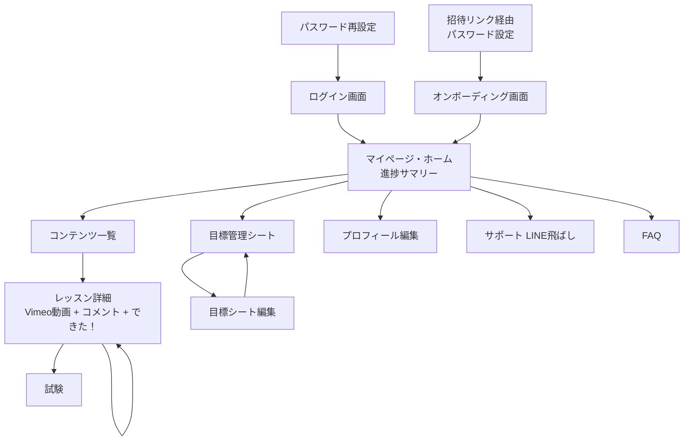
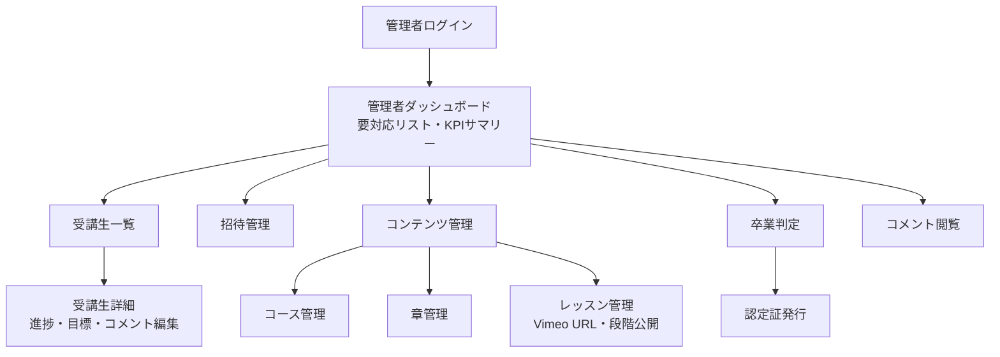
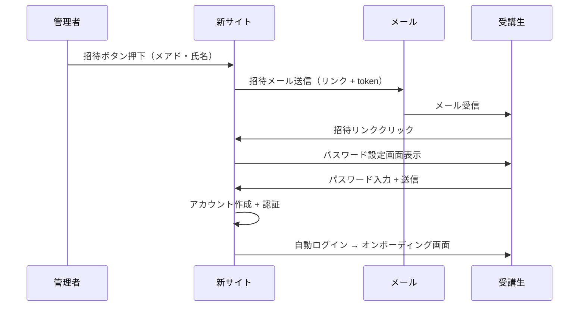

# サイトマップ + 画面遷移図 叩き台

**作成日**: 2026-05-19
**作成者**: Claude（フェーズ0 完了後の単独作業）
**目的**: フェーズ1（骨組み設計）の冒頭で確定するための叩き台
**位置づけ**: 提案レベル。フェーズ2 で詳細なワイヤーフレーム化

---

## 🎯 一言まとめ

> **受講生**は **8画面**、**管理者**（社長・きよむ）は **12画面**（統計・お知らせ配信・CSV エクスポート 3画面追加）。
>
> スマホファースト、シンプル動線、迷わない構造を意識。

---

## 🎯 一言まとめ（更新版）

> **受講生**は **8画面**、**管理者**（社長・きよむ）は **12画面**。

## 👤 受講生視点のサイトマップ

```
[未ログイン]
├── /login                  ログイン画面
├── /invite/{token}         招待リンク経由のパスワード設定
└── /forgot-password        パスワード再設定

[ログイン後]
├── / (HOME)                マイページ・ホーム ★
├── /onboarding             オンボーディング（初回ログイン後のみ）
├── /contents               コンテンツ一覧
│   └── /lessons/{id}       レッスン詳細（動画 + コメント + テスト）
├── /goal-sheet             目標管理シート
├── /faq                    FAQ
├── /support                サポート（LINE 飛ばし）
├── /profile                プロフィール編集
└── (フッターリンク)
    ├── /terms              利用規約
    ├── /privacy            プライバシーポリシー
    └── /operator           運営者情報
```

### 受講生視点の画面遷移図



### 各画面の詳細

#### 🏠 / (HOME / マイページ)
**表示要素**:
- 挨拶 + ユーザー名
- 学習サマリー（受講中コース数、視聴済み％、試験合格数）
- 「続きから学ぶ」ボタン → 直近視聴した未完了レッスン
- 「今日の目標」ウィジェット → 目標管理シートからの抜粋
- 新着コンテンツ通知
- ナビ: コンテンツ一覧 / 目標シート / マイページ / サポート / FAQ

#### 📚 /contents (コンテンツ一覧)
**表示要素**:
- 5大カテゴリの折りたたみアコーディオン
  - 限定ボディメイク完全ロードマップ動画
  - 筋肉塾限定講義liveアーカイブ
  - マインドセットコンテンツ
  - 筋トレのフォーム解説
  - ダイエットレシピ動画解説版
- 各章の進捗% 表示
- 章クリックで章内レッスン一覧（できた！状態表示）
- 段階公開: 未公開レッスンは「○月○日公開」表示

#### 🎥 /contents/lessons/{id} (レッスン詳細)
**表示要素**:
- パンくず: コンテンツ一覧 > カテゴリ > 章 > レッスン
- メイン動画（Vimeo 埋め込み、再生速度変更可）
- 補助画像（解剖図など、ある場合）
- 「全まとめ視聴用」セクション（章まとめ動画、ある場合）
- ナビ: << 一覧へ | **できた！** | 次へ >>
- コメント欄
  - 自分の投稿（編集・削除可）
  - 他受講生の投稿（閲覧のみ、返信ボタンあり）
  - 画像添付
- テスト機能（章末のみ）

#### 🎯 /goal-sheet (目標管理シート)
**表示要素**:
- 現在の目標（最初に設定したもの）
- 編集ボタン → 編集モード
- 編集履歴（過去のスナップショット）
- 管理者からのコメント（あれば）
- 月次振り返り（Should Have、フェーズ2 以降）

#### 🎓 /onboarding (オンボーディング、初回ログイン後)
**表示要素（順番に画面遷移）**:
1. ようこそ！ + サポート期間180日のご案内
2. 学習の進め方（資料3点セット相当の案内）
3. 質問の仕方（質問フォーマット）
4. LINE 連携の案内（オープンチャット参加コード）
5. **目標管理シートの初回記入**
6. メインコンテンツへ案内

#### 👤 /profile (プロフィール編集)
**表示要素**:
- アバター画像
- 名前 / メアド / パスワード（変更リンク）
- 生年月日 / 性別 / 身長
- 住所 / 電話番号
- SNS リンク（Twitter / Facebook / Instagram / LINE）
- 自己紹介

#### 💬 /support (サポート)
**表示要素**:
- 「LINE で質問をする」ボタン → 既存 LINE 飛ばし
- ※将来: noriAI 軽量チャット（Should Have）

#### ❓ /faq (FAQ)
**表示要素**:
- カテゴリ別アコーディオン
  - はじめに
  - 学習・コンテンツ
  - 目標管理シート
  - アカウント・その他
  - trainercloud との連携
- 検索バー（Should Have）

---

## 👨‍💼 管理者視点のサイトマップ

```
[管理者ログイン後]
└── /admin
    ├── /admin                       管理者ダッシュボード ★
    ├── /admin/users                  受講生一覧・管理
    │   └── /admin/users/{id}         受講生詳細（進捗・目標シート閲覧・コメント・編集）
    ├── /admin/invitations            招待管理（新規招待・履歴）
    ├── /admin/contents               コンテンツ管理（CRUD）
    │   ├── /admin/contents/courses   コース管理
    │   ├── /admin/contents/chapters  章管理
    │   └── /admin/contents/lessons   レッスン管理（Vimeo URL・段階公開設定）
    ├── /admin/tests                  試験管理
    ├── /admin/comments               コメント閲覧・モデレーション
    ├── /admin/graduates              卒業判定・認定証発行
    ├── /admin/faqs                   FAQ 編集
    ├── /admin/stripe-events          Stripe Webhook 履歴
    └── /admin/settings               システム設定
```

### 管理者視点の画面遷移図



### 各画面の詳細

#### 📊 /admin (管理者ダッシュボード)
**表示要素**:
- **要対応リスト**（毎朝3秒で全体把握）
  - 🔴 要対応（5名）: 3日以上操作ログなし
  - 🟡 注意（8名）: 卒業判定対象・コメント返信待ち
  - 🟢 順調（9名）: 進捗良好
- **本日の数字**
  - 新規入会数（Stripe Webhook 経由）
  - 招待待ち（決済済み・未招待）
  - 新規コメント数
- **クイックアクション**
  - 「招待する」ボタン
  - 「コンテンツ追加」ボタン
  - 「卒業判定」ボタン

#### 👥 /admin/users (受講生一覧)
**表示要素**:
- 受講生リスト（検索・絞り込み）
- 各受講生: 名前・メアド・ステータス・入会日・最終ログイン・進捗％
- ステータス別タブ（active / lifetime / withdrawn / refunding）
- 詳細ボタン → 受講生詳細画面
- 一括操作（ステータス変更等）

#### 👤 /admin/users/{id} (受講生詳細)
**表示要素**:
- プロフィール情報
- 学習進捗（コース別 / 章別）
- 目標管理シート（閲覧・編集・コメント追加）
- 試験履歴
- コメント履歴
- 通知履歴
- ステータス変更ボタン
- 強制退会ボタン

#### 📧 /admin/invitations (招待管理)
**表示要素**:
- 招待待ちリスト（Stripe Webhook 経由 + 手動追加）
- 「新規招待」ボタン → メアド・氏名入力 → 招待メール送信
- 招待履歴（送信済み・承認済み・期限切れ）
- 招待メール再送機能

#### 📁 /admin/contents/* (コンテンツ管理)
**表示要素**:
- コース・章・レッスンの CRUD（作成・編集・削除）
- ドラッグ&ドロップで並び替え
- レッスン編集画面:
  - タイトル・説明
  - Vimeo URL（プレビュー機能あり）
  - 補助画像アップロード
  - 段階公開設定（指定日時 or 全部解放）
  - サムネ画像

#### 📝 /admin/tests (試験管理)
**表示要素**:
- 試験一覧（章別）
- 試験作成・編集（多肢選択問題）
- 合格点設定（デフォルト80%）
- 受験統計（合格率 etc.）

#### 💬 /admin/comments (コメント閲覧・モデレーション)
**表示要素**:
- 全コメント一覧（時系列）
- 検索・絞り込み（受講生別・レッスン別）
- 不適切コメントの削除（is_deleted フラグ）
- 返信機能

#### 🎓 /admin/graduates (卒業判定)
**表示要素**:
- **卒業判定候補**（自動算出）
  - 180日経過 ✅
  - 目標管理シート達成 ✅
  - その他条件
- 「認定」ボタン押下 → ステータス変更 + 認定証発行タスク生成
- 過去の卒業生一覧（賞状送付ステータス管理）
- 認定証 PDF プレビュー・ダウンロード（Should Have）

#### ❓ /admin/faqs (FAQ 編集)
**表示要素**:
- カテゴリ別 FAQ 一覧
- 編集・追加・並び替え
- 公開／非公開切り替え

#### 💳 /admin/stripe-events (Stripe Webhook 履歴)
**表示要素**:
- Webhook イベント一覧
- 未処理イベント（招待待ち）
- 処理済みイベント
- 失敗ログ・リトライ

#### ⚙️ /admin/settings (システム設定)
**表示要素**:
- 管理者ユーザー管理（superadmin 専用、Should Have S-12 のロール管理画面へ）
- メール送信設定
- LINE Messaging API 設定
- Stripe Webhook 設定
- 通知デフォルト設定

#### 📊 /admin/analytics (統計・分析ダッシュボード) 🆕
**表示要素**:
- **全体学習状況**: 受講生総数 / アクティブ数 / 卒業生数、平均進捗率、章別の視聴率、試験合格率、コメント投稿数推移
- **学習トレンド**: 今週「できた！」を押した受講生数、直近30日の活動推移グラフ、人気レッスン Top10
- **要注意ゾーン**: 進捗率が低い受講生、試験不合格率が高いレッスン、コメント返信待ち件数

→ **サクセスラーニング型の主軸 KPI**を可視化、改善ポイントを見つけるための画面。

#### 📢 /admin/notifications (お知らせ配信) 🆕
**表示要素**:
- **新規お知らせ作成**
  - タイトル / 本文（リッチテキスト）
  - 配信先: 全受講生 / アクティブのみ / 永久対応のみ / 特定の章を学習中の人
  - 配信方法: サイト内通知のみ / メール送信も / 予約配信（日時指定）
- **配信履歴**: 過去のお知らせ一覧、開封率・クリック率

→ 受講生がサイトに戻る理由を作る、継続率に直結。

#### 📥 /admin/exports (CSV エクスポート) 🆕
**表示要素**:
- **受講生一覧 CSV**（経理・バックアップ用）
- **エルメ連携用 CSV**: 条件絞り込み（操作なし○日 / 完了率○%以下 等）→ CSV ダウンロード
- 過去のエクスポート履歴

---

## 🔐 認証フローの詳細



---

## 📱 スマホファースト UI の基本原則

1. **タップ可能領域は最低44×44px**（Apple HIG準拠）
2. **画面下部に主要ナビ**（親指で届く範囲）
3. **動画再生は縦画面でも自動切替**（全画面モード対応）
4. **入力フォームは1画面1項目** or 短いフォーム
5. **ローディング状態を必ず表示**（受講生の不安を減らす）
6. **エラー時は具体的に**（「失敗しました」ではなく「メアド形式が間違っています」）

---

## 🎨 主要なボタン・遷移パターン

### 受講生のメインフロー
```
ホーム → 「続きから学ぶ」 → レッスン詳細 → 動画視聴 → 「できた！」 →
「次へ >>」で次のレッスン → 章完了 → 試験 → 合格 → 次の章へ
```

### 管理者のメインフロー（毎日）
```
ダッシュボード → 要対応リスト確認 → 該当受講生の詳細 →
コメント返信 or 個別連絡（LINE経由）→ ダッシュボード戻る
```

### 管理者のメインフロー（招待時）
```
Stripe Webhook 通知 → ダッシュボードに「招待待ち」表示 →
「招待」ボタン → メアド・氏名確認 → 送信 → 完了
```

---

## 🚨 仮置きの箇所（フェーズ1で確定）

| 箇所 | 状態 |
|---|---|
| /onboarding の詳細フロー | 6ステップで仮置き、フェーズ1 で精緻化 |
| /admin/graduates の認定証発行ロジック | 「ステータス変更 + 賞状発送タスク生成」で仮置き、紙の管理は別途要確認 |
| /admin/stripe-events の権限 | superadmin のみ閲覧可能で仮置き |
| 「ホーム」の表示要素 | 進捗サマリー + 続きから学ぶで仮置き、デザインで詳細化 |

---

## 📋 きよむさんへの確認事項

1. **受講生 8画面の構成、過不足ない？**
2. **管理者 12画面の構成、過不足ない？**
3. **オンボーディング画面の6ステップ、足りない・多すぎる項目あれば**
4. **「ホーム」画面の表示要素、こうしたいという要望があれば**
5. **管理画面のデザイン参考にしたいサービスは？**（trainercloud / Notion / Slack 等）

---

## 🚀 フェーズ1〜2 で進めること

### フェーズ1（骨組み設計）
- 各画面の **詳細ワイヤーフレーム**（要素・配置・遷移）
- **データフロー**（画面 ↔ DB の対応関係）
- **API エンドポイント設計**

### フェーズ2（デザイン）
- 各画面の **デザインカンプ**（色・フォント・余白）
- **ブランドガイドライン**（既存 saipon サイトのトーンを継承）
- **コンポーネントライブラリ**（Tailwind UI 等の活用）

---

## 🔗 関連ファイル

- 技術スタック提案: [`tech_stack_proposal.md`](./tech_stack_proposal.md)
- DB 設計叩き: [`database_design_draft.md`](./database_design_draft.md)
- 事業コンテキスト統合: [`business_context.md`](./business_context.md)
- フェーズ0 完了報告: [`phase0_summary.md`](./phase0_summary.md)
